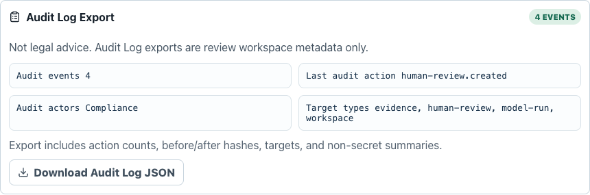

# LexProof AuditOS

LexProof AuditOS is a legal and compliance audit MVP for **BLI Legal Tech Hackathon 2** on DoraHacks. It helps Web3 teams turn messy launch facts into a counsel-ready audit workspace with risk flags, remediation owners, editable evidence records, deterministic manifest hashes, source references, and downloadable Markdown counsel packs.

This project is not legal advice. It is an audit preparation workflow for lawyers, compliance teams, and builders.

## Pitch

**Problem:** early Web3 teams often approach counsel with scattered token terms, custody assumptions, KYC policies, AI drafts, governance notes, and launch claims. That makes legal/compliance review slower, more expensive, and harder to verify.

**Users:** founders, compliance leads, protocol engineers, and counsel preparing a launch, RWA pilot, DAO action, custody workflow, or AI legal/compliance product for review.

**Workflow:** create a project, run deterministic risk triage, use AI only for draft audit preparation, attach or request evidence, generate stable hashes, and export a counsel-ready packet.

**Why now:** Web3 teams increasingly mix AI-generated work, tokenized assets, custody controls, and multi-jurisdiction launches. The review handoff needs source lineage and evidence integrity, not another generic chatbot.

**Why BLI:** the hackathon's legal, compliance, finance, AI, RWA, RegTech, Bitcoin, Ethereum, and broader Web3 themes match a focused audit-preparation operating system with a clear non-advice boundary.

## Why This Hackathon

I selected BLI Legal Tech Hackathon 2 as the highest value non-Casper DoraHacks target because it is active, virtual, open worldwide, has a long runway, and aligns with a feasible but strong MVP across legal, compliance, AI, RegTech, finance, RWA, and blockchain themes.

Key evidence:

- DoraHacks lists BLI Legal Tech Hackathon 2 with legal, finance, compliance, AI, RWA, RegTech, Bitcoin, and Ethereum themes.
- CompeteHub summarizes the prize/support pool as $50k+ and the deadline as November 1, 2026.
- BLI's own hackathon page centers law, finance, compliance, mentoring, bounties, and builder support.
- Past BLI-adjacent projects rewarded verified data, digital evidence, and tamper-proof audit trails.

## MVP Features

- Custom Project Workspace for creating a local audit project from zero or loading synthetic samples.
- Step-by-step Audit Wizard for reviewing facts, AI/data/chain boundaries, and handoff readiness.
- Model Intake for registering provider/model purpose, allowed data classes, human-review owner, editable hashed AI event review records, and downloadable Model Intake JSON.
- AI Review with mock and OpenAI-compatible model settings, Model Access Workflow, Model Connection Readiness, audit-prep extraction, draft questions, and missing evidence suggestions.
- Redaction Gate before model calls, with evidence payload previews, KYC/personal-data warnings, and blocker handling for private-key-like material.
- Export Safety Gate before Counsel Pack handoff, with data-boundary findings for private keys, API keys, raw KYC, personal-data references, and confidentiality labels.
- AI Review Run Ledger with local payload and response hashes for each completed model review.
- Server Model Gateway receipts, Model Gateway Evaluation artifacts, and Audit Log Export artifacts with payload hash, response hash, source evidence hash, provider policy metadata, human-review status, retry/error state, audit actions, before/after hashes, and remediation steps without returning raw payloads or credentials.
- Human Review queue with reviewer assignment, due dates, saved status history, linked evidence and model-run status updates, server-side queue views by target/status/reviewer, and downloadable review timeline JSON with audit log IDs.
- Editable Counsel Questions queue that combines deterministic risk prompts, AI draft questions, user edits, status, and priority.
- Editable Counsel Review Status queue for each deterministic risk flag, with reviewer, status, evidence summary, and notes.
- Regulatory Command Center first screen with jurisdiction readiness, source-backed clause triggers, evidence gaps, manifest readiness, and counsel handoff status.
- Regulatory Source Graph for official-source audit-prep triggers across US SEC/CFTC, EU MiCA, UK FCA, Singapore MAS, Swiss FINMA, and UAE VARA references.
- Jurisdiction Checklist for core US, EU, and UK audit-prep prompts without legal conclusions.
- Jurisdiction Packs with policy controls, evidence-ready status, and local-counsel routing for US, EU, UK, Singapore, Switzerland, UAE, and fallback jurisdictions.
- Weighted legal/compliance risk audit with explicit flags, owner assignments, source links, “why this flag triggered” issue cards, per-risk evidence workflow coverage, and one-click missing evidence requests.
- Editable Evidence Ledger with evidence status, owner, source notes, local file SHA-256 metadata intake, visible edit labels, long-row wrapping, item hashes, manifest bundle hash, and local evidence change trail.
- Evidence Retention Readiness panel that classifies metadata-only evidence, personal-data review needs, and vault-sync blockers for private-key-like material, API keys, and raw KYC references with a metadata-only retention policy JSON export.
- Evidence Vault versioning with duplicate-hash detection, rejected-record replacement, parent/superseded lineage, replacement reasons, server-enforced status transitions, and metadata-only recovery actions.
- Evidence Templates for tokenized yield/RWA issuance, DAO governance/multisig execution, and AI legal/compliance workflows.
- Evidence Manifest generator with deterministic SHA-256 item hashes, bundle hash, and JSON download.
- Simulated Anchor Receipt for the manifest bundle hash. It is explicitly not a real on-chain write.
- Counsel Pack Markdown download and browser Print / Save PDF handoff with non-advice disclaimer, project facts, risk posture, regulatory source graph, editable counsel questions, counsel review statuses, manifest hash, source pack, and remediation queue.
- Counsel Pack export templates for launch readiness, RWA/tokenized asset review, AI governance review, custody controls, and marketing claims, with template-specific review agendas and evidence focus in the Markdown packet.
- Counsel Pack version history with manifest hash, Markdown hash, source snapshot, review status summary, diff from the previous export, and metadata-only JSON download.
- Server-side Counsel Pack export records through the Phase 2 API, storing export hashes, version metadata, review summary, source count, and audit-log entries without raw Markdown, KYC, personal data, or credentials. Blocked data-boundary findings disable Markdown/PDF, manifest JSON, simulated anchor, version save, and server export actions until remediated.
- Submission fit scorecard for BLI themes and required DoraHacks assets.
- Responsive React workbench with tabs for Audit Wizard, AI Review, Model Intake, Jurisdiction Checklist, Risk Audit, Evidence Ledger, Counsel Pack, and Sources.

## Product Screenshots

Risk Audit explains deterministic trigger facts and links source context for counsel review.

The Regulatory Command Center turns project facts into source-backed jurisdiction triggers, evidence gaps, and local counsel handoff status without making legal conclusions.


AI Review keeps model output as draft audit preparation, shows a Model Access Workflow for setup/run/human-review status, and records local run receipts with payload and response hashes.


Model Intake records provider purpose, human review readiness, AI event hashes, and standalone JSON export.


Evidence Ledger records local evidence creation, template application, edits, and removals as audit-prep events with a standalone JSON export.


Evidence Retention Readiness blocks Evidence Vault sync when evidence contains private-key-like material, API-key-like credentials, or raw KYC references, and exports metadata-only retention policy JSON. Not legal advice.


Evidence Vault recovery preserves rejected evidence as superseded metadata and creates a received replacement record with parent lineage and a replacement reason.


Human Review records reviewer due dates, saved status history, audit log IDs, and a downloadable review timeline.


The Phase 2 secure review journey connects Model Connect, metadata-only Evidence Vault sync, Model Gateway receipts, Human Review, audit log records, and Counsel Pack handoff. If the server gateway blocks a run, the UI shows the persisted failure receipt run ID, retry state, remediation steps, and the Not legal advice boundary.


Model Gateway Evaluation turns the server receipt into a metadata-only review artifact with payload/response/source-evidence hashes, provider policy, retry state, and a JSON download for human review. Not legal advice.


Audit Log Export turns Secure Review Journey audit-log records into a metadata-only timeline with actors, action counts, targets, before/after hashes, and JSON download.




Counsel Pack exports template-specific Markdown, browser Print / Save PDF output, Model Intake summary, AI event hashes, manifest JSON, version-history JSON, and a simulated anchor receipt without claiming a real chain write. Model Intake can also download its own profile, event ledger, readiness checklist, and event hashes as JSON.


Counsel Pack export templates route the same project facts into launch, RWA/tokenized asset, AI governance, custody controls, or marketing claims review agendas while keeping missing evidence visible.


The Export Safety Gate scans the current project, evidence ledger, counsel questions, review notes, and AI event records before export. It shows blocked/warning findings and keeps raw KYC, credentials, and private-key-like material out of export actions.


Counsel Pack version history records the manifest hash, Markdown hash, review-status snapshot, source snapshot, export timestamp, and diff from the previous export without storing raw Markdown content in the version JSON.


Server export records let the demo create a Phase 2 API-backed Counsel Pack handoff from the latest saved Pack Version. The server record is metadata-only and repeats the Not legal advice boundary.


## Hackathon Demo Runbook

The runnable judge path is documented in [docs/demo-script.md](docs/demo-script.md). It starts the Phase 2 API, opens the Vite app, and walks through:

1. Model Connect validation with the mock local reviewer.
2. Evidence selection or local metadata-only evidence intake.
3. Deterministic Risk Audit with source-linked issue cards.
4. Human Review return flow that moves linked evidence back to `requested` and records a downloadable review timeline.
5. Secure Review Journey across Evidence Vault, Model Gateway, Model Gateway Evaluation, Human Review, audit log routes, and Audit Log Export.
6. Counsel Pack template selection, version save, server export record creation, Markdown export, Manifest JSON, and simulated anchor receipt.

Screenshots for the exact demo path:


Every step is audit preparation only. Not legal advice.

## How Users Connect Models

LexProof uses a controlled BYOM/BYOK model workflow:

1. Open **Model Intake** to register the provider/model purpose, endpoint type, allowed data classes, and required human-review owner. Model Intake stores no API keys.
2. Record AI event intake entries for model outputs that need audit tracking. AI Review runs also create a Model Intake event automatically. Each event receives a deterministic SHA-256 hash, reviewer, and editable review status.
3. Open **AI Review** and use the built-in mock reviewer for demos, or choose the OpenAI-compatible provider.
4. Enter a base URL, model name, and API key. In this first-stage SPA, the API key is kept in browser state and is not persisted to `localStorage`.
5. Check **Model Access Workflow** and **Model Connection Readiness**. The workflow shows Model Intake, provider setup, Redaction Gate, model run, and human-review/export status. Readiness shows whether the mock reviewer is ready, whether live OpenAI-compatible settings are incomplete, or whether the Redaction Gate blocks the run.
6. Review the **Redaction Gate** payload summary before running the model.
7. Run AI Review only after evidence summaries are clean or reviewed. Private-key-like material blocks model calls.
8. After a completed run, inspect the **AI Review Run Ledger** for provider/model metadata, redaction status, payload SHA-256, response SHA-256, and a downloadable run JSON receipt. The same run is also recorded in **Model Intake** as a needs-review AI event.
9. Run **Secure Review Journey** against the Phase 2 API to create a backend workspace, sync metadata-only evidence, create a server Model Gateway receipt, open Human Review, and fetch audit log records. The server request is limited to audit-prep metadata, evidence hashes, and risk flag summaries.
10. Mark AI events reviewed or rejected in **Model Intake** after human review, download **Model Intake JSON** for the model-event audit trail, then open **Counsel Pack** to choose an export template, review the Export Safety Gate, and export the Model Intake Summary, readiness status, human-review owner, review statuses, AI event hashes, Counsel Pack version metadata, and a server-side export metadata record with the review packet.

Model output is draft audit preparation only. It does not change deterministic risk scoring, make legal conclusions, perform KYC, or replace counsel review. Model Intake records are local audit-prep metadata, not final adjudication.

## First-Stage Workflow

1. Open the app and click **New project**, or load one of the synthetic sample profiles.
2. Fill in project facts in the Project Workspace. Do not enter raw KYC, private keys, or personal data.
3. Review the **Regulatory Command Center** for jurisdiction readiness, official-source triggers, evidence gaps, and the non-advice handoff boundary.
4. Open **Model Intake** to document model purpose, allowed data classes, human review owner, and any AI event records that need traceability.
5. Open **AI Review** to inspect Model Access Workflow, Model Connection Readiness, review the Redaction Gate, and run the mock reviewer or an OpenAI-compatible model. AI output is draft audit preparation, not legal advice, and each completed run receives a local hash receipt plus an automatic Model Intake event for human review.
6. Return to **Model Intake** to assign a reviewer, move AI event records from `needs-review` to `reviewed` or `rejected`, and download Model Intake JSON when the model-event ledger needs a standalone handoff.
7. Open **Jurisdiction Checklist** to see preparation prompts, jurisdiction packs, policy controls, evidence-ready status, and local-counsel routing for counsel review.
8. Open **Risk Audit** to see current risk level, source-linked issue cards, trigger facts, weighted flags, evidence workflow coverage, remediation owners, and missing evidence request actions.
9. Add or edit records in **Evidence Ledger**, hash a local file into metadata-only evidence, request missing evidence from Risk Audit, or apply one of the scenario templates for tokenized yield/RWA, DAO governance/multisig, or AI compliance workflows. The manifest updates with per-item hashes and a bundle SHA-256, while the Evidence Audit Trail records local evidence creation, template application, edits, removals, and a JSON export. Check **Evidence Retention Readiness** before vault sync; private-key-like material, API-key-like credentials, and raw KYC references block Evidence Vault sync until replaced with metadata-only summaries.
10. Open **Human Review** to assign reviewers, adjust due dates, save returned/reviewed/rejected decisions, and download the Human Review timeline JSON for status history with audit log IDs.
11. Run **Secure Review Journey** to sync metadata-only evidence to the Phase 2 API, create a server Model Gateway receipt, open Human Review, and record audit-log events. Gateway policy failures are shown as recoverable failure receipts with run IDs and remediation steps.
12. Open **Counsel Pack** to choose an export template, inspect the Export Safety Gate, edit the counsel question queue, update review status for each risk flag, save a Pack Version to capture manifest/Markdown hashes and review-status diff, create a server export record from that latest version when the Phase 2 API is running, then download the Markdown audit-prep packet with Regulatory Source Graph, Model Intake summary and AI event hashes, use browser Print / Save PDF, download version JSON, download manifest JSON, or create a simulated anchor receipt JSON for counsel/compliance review. If the gate detects private keys, API keys, or raw KYC materials, these export actions are disabled until the evidence is replaced with metadata-only summaries.

Workspace data is stored locally in browser `localStorage`. Local file evidence is hashed in the browser and stored as file metadata plus SHA-256, not raw file bytes. The Phase 2 API stores workspace, evidence metadata, model-run receipt, human-review, audit-log, and Counsel Pack export metadata records in SQLite when enabled. It does not store model credentials, raw KYC, personal data, raw evidence bytes, raw Markdown, or real chain transactions. API keys for live browser model calls are held in browser state and are not persisted. Model Intake JSON, Evidence Audit Trail JSON, Evidence Retention Policy JSON, Model Gateway Evaluation JSON, Audit Log Export JSON, Counsel Pack version JSON, Model Gateway receipts, server export records, and model-run ledger exports store hashes and metadata, not credentials or raw Markdown content. Evidence Retention Readiness redacts detected secrets in snippets and blocks Evidence Vault sync for private-key-like material, credential-like tokens, and raw KYC references. The Evidence Vault API blocks invalid status transitions such as directly reactivating rejected or superseded records; users must use replacement recovery so lineage remains visible. The Export Safety Gate redacts detected secrets in the preview and blocks export handoff for the same blocked data classes. The anchor receipt is a local simulation for manifest handoff only.

## Tech Stack

- React 19
- TypeScript
- Vite
- Vitest
- Testing Library
- Lucide React icons

## Project Docs

- [WORKFLOW.md](WORKFLOW.md): direct-to-main development and push workflow.
- [ARCHITECTURE.md](ARCHITECTURE.md): module boundaries, data flow, and extension points.
- [CONTRIBUTING.md](CONTRIBUTING.md): product and engineering guardrails.
- [docs/work-universe.md](docs/work-universe.md): complete build universe and product direction for future work.
- [docs/architecture-guardrails.md](docs/architecture-guardrails.md): placement rules that keep new features aligned with the existing structure.
- [docs/engineering-workflow.md](docs/engineering-workflow.md): verification matrix, screenshot policy, cleanliness rules, and agent prompt contract.
- [docs/research.md](docs/research.md): hackathon selection and audit research notes.
- [docs/product-strategy.md](docs/product-strategy.md): competition fit, product outlook, gaps, and roadmap.
- [docs/phase-2-secure-review-workspace.md](docs/phase-2-secure-review-workspace.md): near-term Secure Review Workspace plan and backend-boundary contracts.
- [docs/phase-2-backend-design-spike.md](docs/phase-2-backend-design-spike.md): Week 2 backend stack decision, API contracts, schema draft, and security boundaries.
- [docs/submission-pack.md](docs/submission-pack.md): screenshot-backed pitch, demo path, and submission narrative.

## Run Locally

```bash
npm install
npm run verify
npm run dev
```

The dev server defaults to `http://127.0.0.1:5173`.

The Phase 2 API backend can be built and started separately:

```bash
npm run build:server
npm run start:api
```

The API defaults to `http://127.0.0.1:8787` and currently exposes `GET /api/health`, Model Gateway adapter readiness, Workspace create/read/update routes, multipart Evidence Vault upload/list/update/replacement/manifest routes, mock Model Gateway run routes, Human Review create/update/list plus queue-view routes, Counsel Pack export-record create/list/read routes, Audit Log listing, and Prisma/SQLite persistence for workspace/evidence/model/review/export/audit records. Evidence uploads are hashed server-side and responses stay metadata-only. Duplicate evidence hashes are blocked with recoverable errors, rejected vault records can be superseded by replacement metadata with parent lineage and a replacement reason, and invalid status transitions return recovery guidance before any write or audit-log mutation. Model Gateway runs enforce Redaction Gate status, allowed data classes, purpose, human-review owner, credential/KYC blockers, and adapter policy. Successful runs persist payload hash, response hash, source evidence hash, provider metadata, retry state, and human-review status. Failed or blocked runs persist safe failure receipts with run IDs, retry state, error codes, and remediation steps without returning raw payloads. Human Review queue views group filtered review records by target type, status, reviewer, and next action without representing review as legal approval; evidence-target decisions sync Evidence Vault status, and model-run decisions sync Model Gateway human-review status plus audit-log metadata. Counsel Pack export records persist version number, artifact name, manifest hash, artifact hash, review summary, source count, and the Not legal advice boundary without storing raw Markdown/PDF content. The backend only enables the local mock model adapter in this phase; OpenAI-compatible and enterprise-proxy adapters are listed as disabled placeholders until server-side secret policy is approved. It does not persist uploaded file bytes, store model credentials, process KYC, call external model providers, or write to a blockchain.

For the scripted hackathon demo, use a disposable SQLite file:

```bash
npm run build:server
DATABASE_URL=file:./demo-review-workspace.db npm run start:api
```

Then run the frontend in another terminal:

```bash
npm run dev
```

## Submission Assets

- Public GitHub repository: this repo
- Demo video: record the scripted flow in [docs/demo-script.md](docs/demo-script.md), including Model Connect, Evidence Ledger, Risk Audit, Human Review, Secure Review Journey, and Counsel Pack export
- DoraHacks BUIDL submission: use the generated Counsel Pack and README summary
- Screenshot-backed submission narrative: see [docs/submission-pack.md](docs/submission-pack.md)
- Source pack: see [docs/research.md](docs/research.md)
- Demo script: see [docs/demo-script.md](docs/demo-script.md)

## Sources

- DoraHacks BLI page: https://dorahacks.io/hackathon/legal-hack-2026/detail
- BLI hackathon page: https://bli.tools/hackathon/
- CompeteHub BLI summary: https://www.competehub.dev/en/competitions/dorahackslegal-hack-2026
- Constellation Labs BLI 2025 highlights: https://medium.com/constellationlabs/building-the-future-of-legal-innovation-highlights-from-the-blockchain-legal-institute-hackathon-c65899009f75
